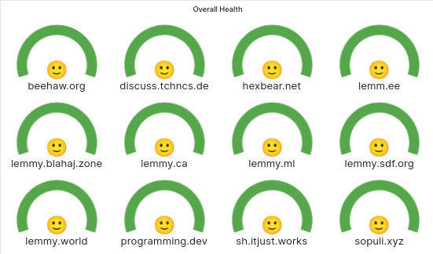

# 1. lemmy-meter

A solution for Lemmy end-users, like me, to check the health of their favourite instance in 3
levels of details.

# 1. Health Reports

lemmy-meter provides 3 levels of reports.

## 1.1 Overall Health

This is what you are, almost always, interested in.  



A single gauge which tells you if your instance is

* <span color="#56a64b">🟢 Green</span>: **none** of the health checks are failing 🙂  
_Your instance is healthy and doing well._

* <span color="#ff780a">🟠 Orange</span>: **some** of the health checks are failing 🫤  
_Your instance may be partially down; for example mobile APIs may not be working._

* <span color="#e02f44">🔴 Red</span>: **all** health checks are failing 🙁  
_Your instance may be completely down; for example during a planned maintenance._

## 1.2 Endpoint Health

A breakdown of [overall health](#health-reports) by few, subjectively, important endpoints:

* Landing page: the web page users when they visit the instance.
* Select API endpoints which are used by mobile (and desktop) applications:
  - getPosts
  - getComments
  - getCmmunities
  
## 1.3 Endpoint Response Time Rates

A visual representation of the fluctuations in endpoint response times over a 5 minute rolling window.  
In simple terms, the graph shows how much the average response has changed over time.  Not that
it does not represent the actual response times but only the fluctuations.

## How To Run

*The only dependency is [bmakelib](https://github.com/bahmanm/bmakelib).*

### Launch 

Simply run

```
$ make up
```

and then access Grafana at http://localhost:3000 *(admin/admin)*

### Shutdown

Simply run

```
$ make down
```
